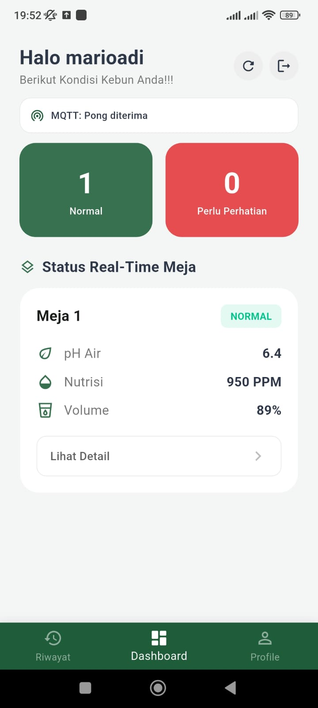
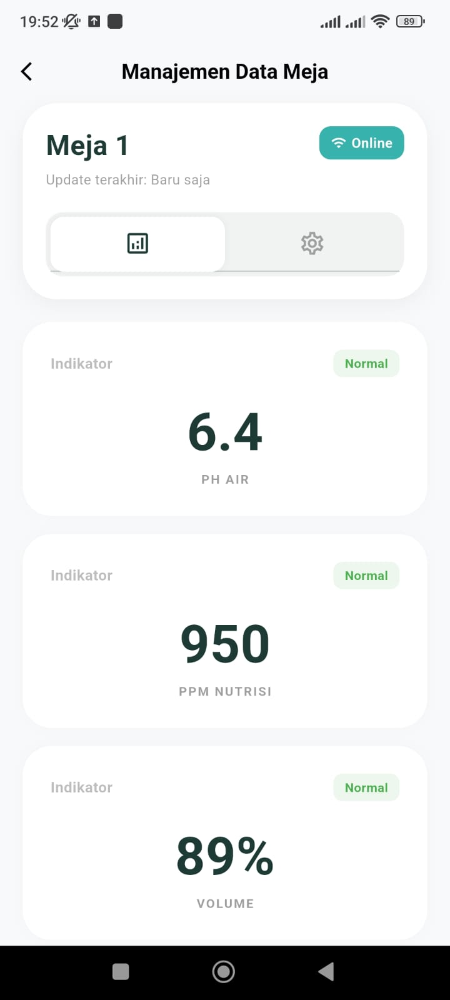
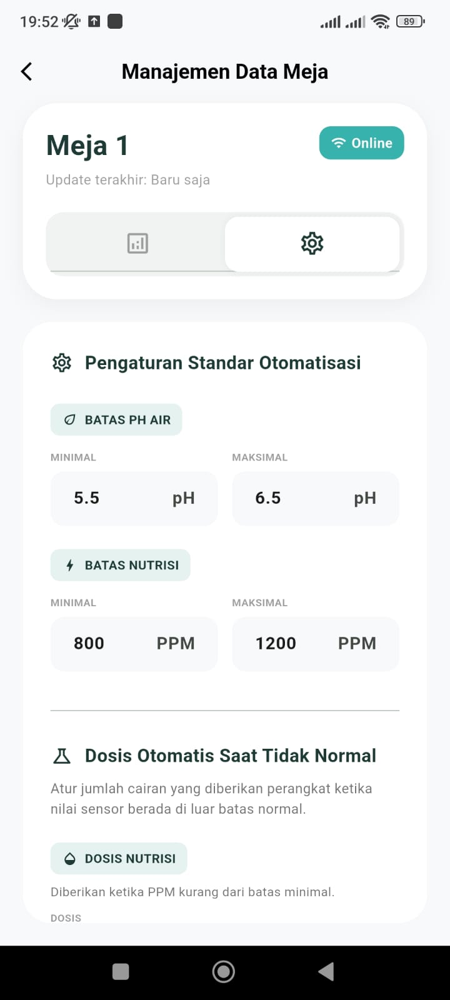
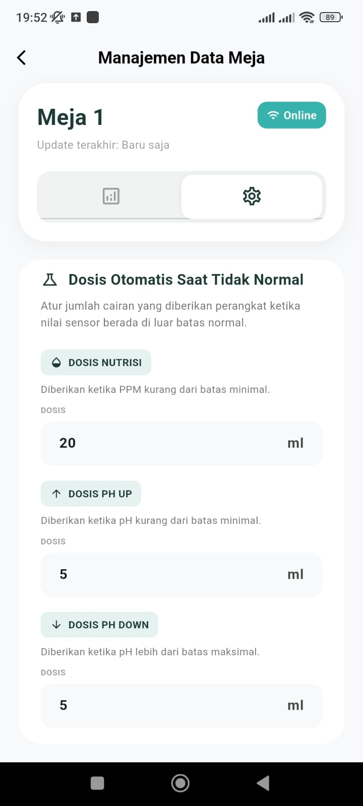
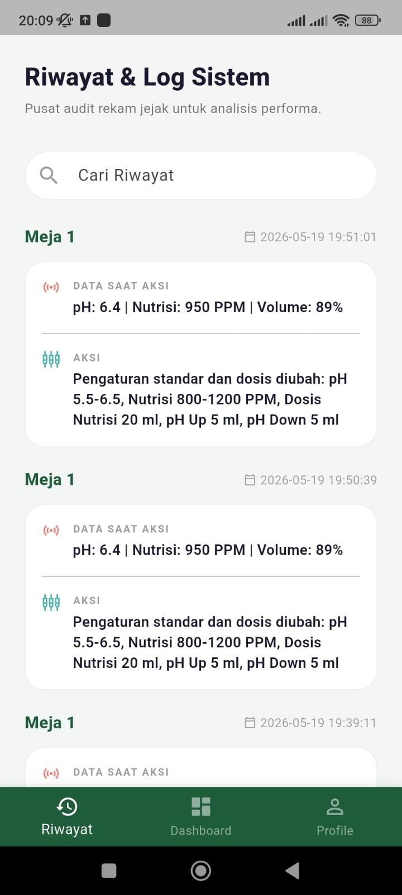
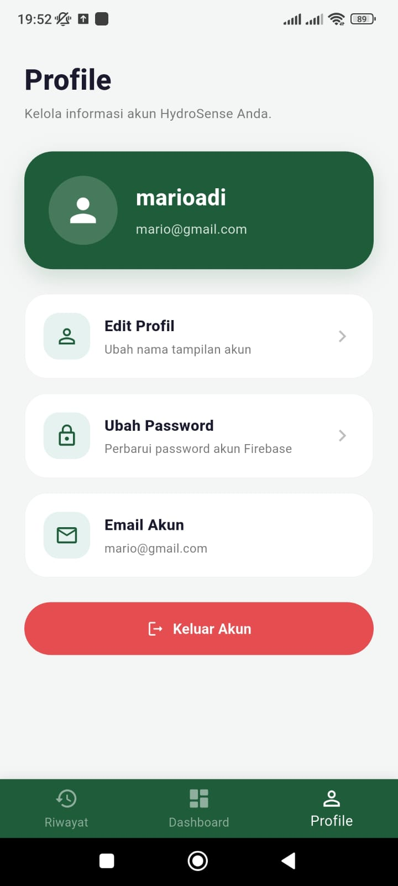

# HydroSense - Sistem Monitoring Hidroponik Berbasis IoT

HydroSense adalah aplikasi mobile berbasis Flutter yang digunakan untuk memantau kondisi tanaman hidroponik secara real-time melalui integrasi IoT, MQTT HiveMQ, dan Firebase. Aplikasi ini membantu pengguna memantau nilai pH air, nutrisi/PPM, serta volume air pada setiap meja hidroponik. Selain monitoring, HydroSense juga menyediakan fitur pengaturan standar otomatisasi yang dapat dikirim ke perangkat IoT melalui MQTT.

## Deskripsi Singkat

HydroSense dirancang sebagai sistem monitoring hidroponik cerdas yang menghubungkan aplikasi mobile dengan perangkat IoT. Data sensor dari perangkat dikirim melalui HiveMQ menggunakan protokol MQTT, kemudian ditampilkan secara real-time pada dashboard aplikasi. Aplikasi juga terhubung dengan Firebase untuk autentikasi pengguna, penyimpanan data sensor terkini, dan pencatatan riwayat aktivitas penting.

## Fitur Utama

- Login menggunakan Firebase Authentication
- Lupa password melalui email Firebase
- Dashboard monitoring real-time dari MQTT HiveMQ
- Menampilkan status normal dan tidak normal setiap meja hidroponik
- Detail monitoring pH, nutrisi/PPM, dan volume air
- Pengaturan batas minimal dan maksimal pH
- Pengaturan batas minimal dan maksimal nutrisi
- Pengaturan dosis otomatis saat kondisi tidak normal
- Pengiriman setting otomatisasi ke perangkat IoT melalui MQTT
- Penyimpanan data sensor terkini ke Firebase Realtime Database
- Riwayat aktivitas penting, seperti perubahan setting IoT
- Edit profil pengguna
- Ubah password akun
- Logout akun

## Teknologi yang Digunakan

- Flutter
- Dart
- Firebase Authentication
- Firebase Realtime Database
- MQTT
- HiveMQ Cloud
- Android

## Dokumentasi Tampilan Aplikasi

### 1. Dashboard Monitoring

### 2. Detail Monitoring

### 3. Pengaturan Standar Meja

### 3. Pengaturan Dosis Meja

### 5. Riwayat Aktivitas

### 6. Profile Page

